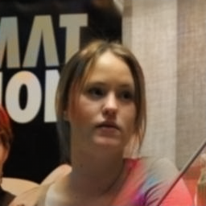
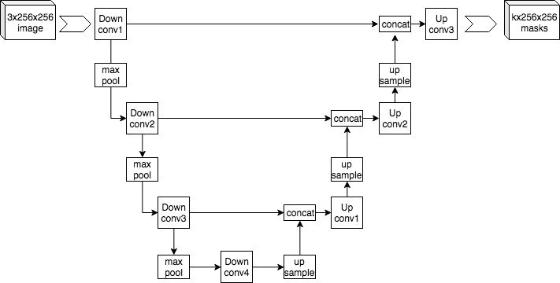

# Painting-Images-With-GAN


### Real Image

### Fake Image

## Table of Contents

* [About The Project](#About-The-Project)
* [Getting Started](#Getting-Started)
  * [Prerequisites](#Prerequisites)
  * [Project structure](#Project-structure)
  * [Installation](#Installation)

## About The Project
* The dataset is taken from Kagle. You can get the dataset [here](https://drive.google.com/drive/folders/1gunX7CRJhp00LRHE2eP_uldoaQNv9ARO?hl=vi)
* This is collected and divided into 2 datasets: train and test. You must be put in `data` folder.
* **Genenator**: Unet

* **Discriminator**: PatchNet
## Project structure
```
.
├── app
│         └── main.py
├── data
│         ├── Test.zip
│         └── Train.zip
├── images
│         ├── generated_images
│         ├── img.png
│         └── test.png
├── models
│         ├── checkpointD.pth.tar
│         └── checkpointG.pth.tar
├── README.md
├── requirement.txt
└── src
    ├── Discriminator.py
    ├── Genenator.py
    ├── images
    ├── MyDataset.py
    └── train.py

```

## Getting Started
### Prerequisites
You need to install the following software on your computer:
* Python 3.9 or latest
* pip
### Installation
1. **Clone the repository:**
<pre>
git clone https://github.com/alloc110/Painting-Images-With-GAN
https://github.com/alloc110/Painting-Images-With-GAN
</pre>
2. **Create virtual environment:** 
<pre>
python -m venv Painting-Images-With-GAN
</pre>
3. **Install Packages:** 
<pre>
pip install requiretment.txt
</pre>

4. **Run main.py:** 
<pre>
python app/main.py
</pre>